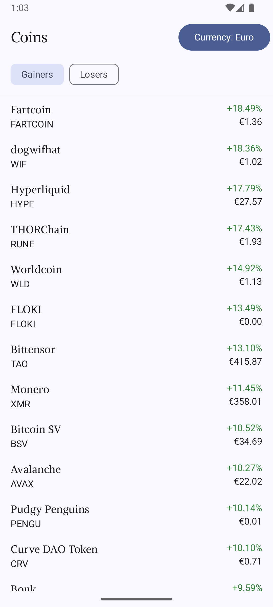
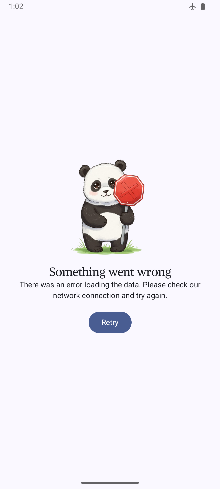

## Info

This is a best practice implementation of an asset browser for Android with the use state-of-the-art technologies and architecture.

## Screenshots




## Build and Run

There are two build flavors: production and dummy. The Production flavor requires the setup of the CoinCap API key to perform the ReST requests and load current assets and currency exchange rates.

```bash
echo COINCAP_API_KEY=${COINCAP_API_KEY} >> ./production.properties
```

Gradle tasks to run tests with production flavor:
```bash
./gradlew ktlintCheck
./gradlew testProductionDebugUnitTest
./gradlew validateProductionDebugScreenshotTest
```

## Architecture

The application is structured by following the Model-View-ViewModel (MVVM) architectural pattern.
The [MainActivity](app/src/main/java/at/sfraungruber/assetbrowser/ui/MainActivity.kt) serves as the application's entry point, responsible for setting up the navigation controller and defining navigation paths with the initial View.

## Theme

The theme was generated with the following online tool: [Material Theme Builder](https://material-foundation.github.io/material-theme-builder/)
